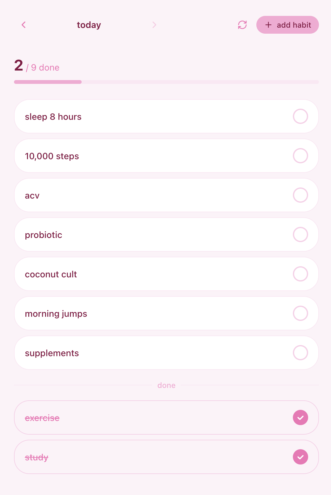
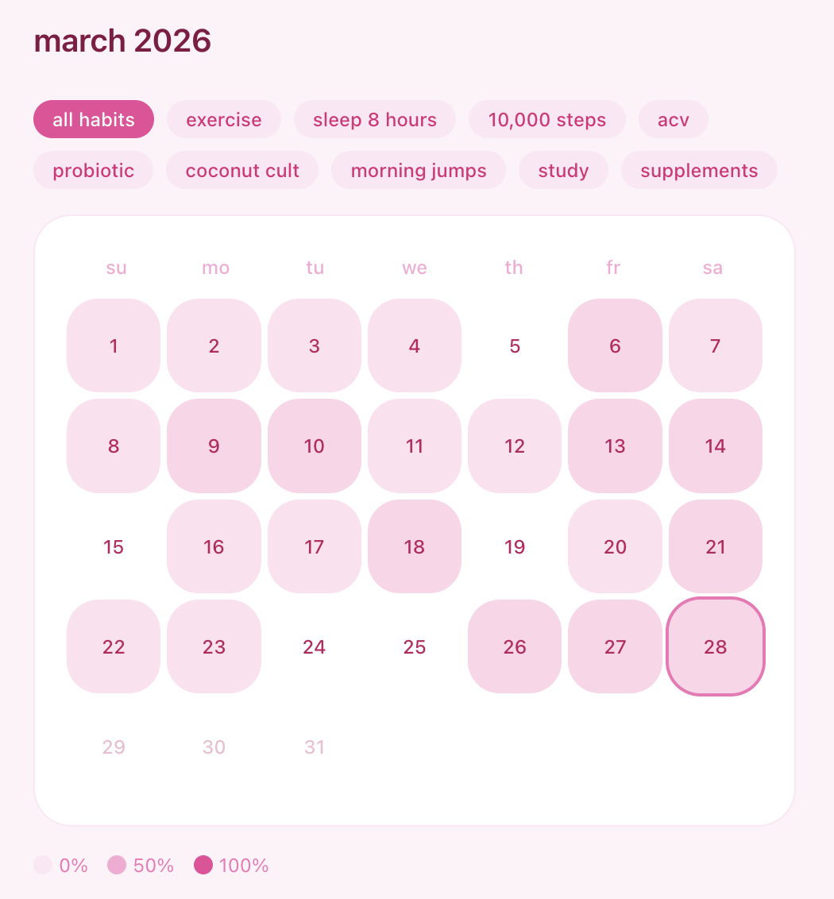
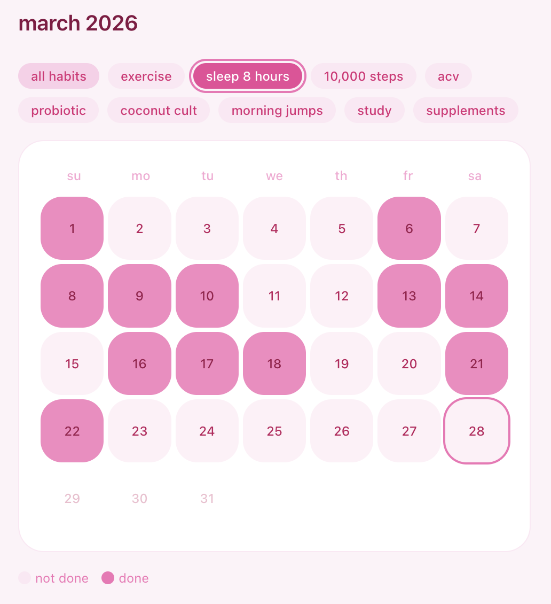
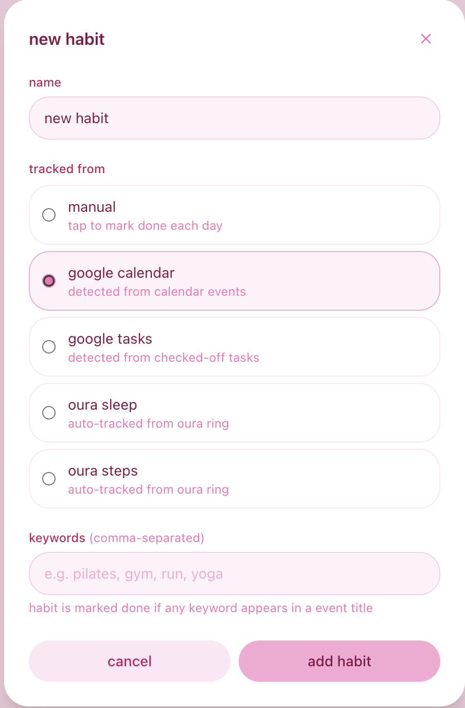
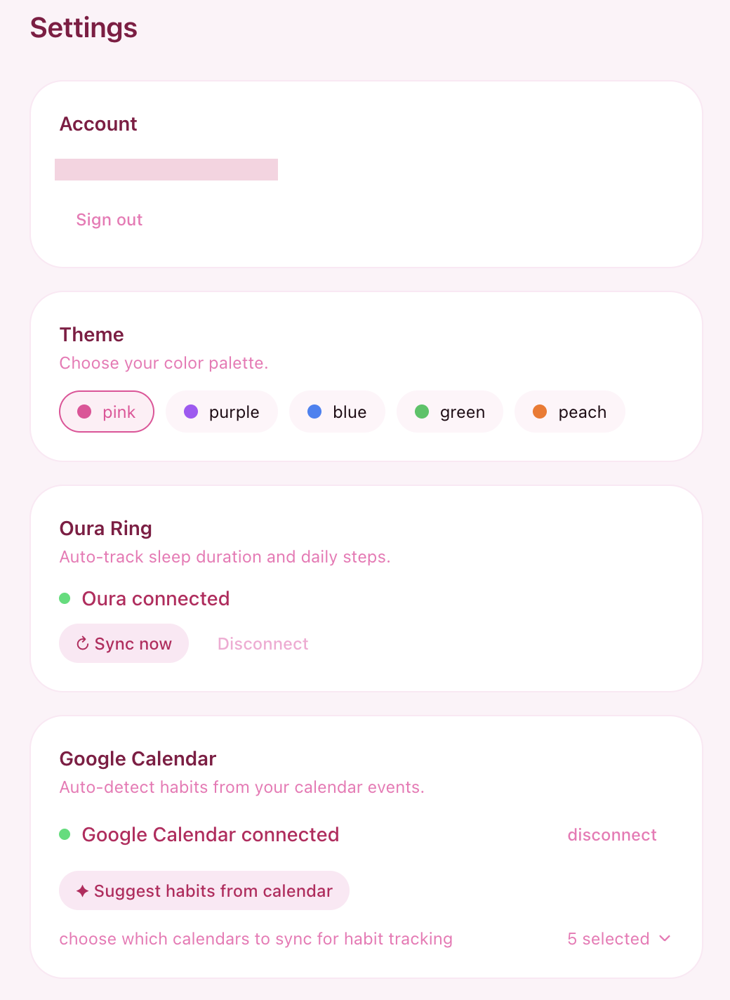

# habit tracker

A personal daily habit tracker that automatically syncs with your Oura Ring and Google Calendar so you don't have to log everything manually.

## Features

**Daily tracking**
- See all your habits for the day and mark them complete
- Progress counter shows how many you've done
- Navigate back through previous days

**Auto-sync integrations**
- **Oura Ring** — sleep and step habits are marked automatically based on your ring data (e.g. 8+ hours sleep, 10,000 steps)
- **Google Calendar** — habits are detected from your calendar events by keyword (e.g. an event called "gym" marks your exercise habit done)
- **Google Tasks** — habits can also be matched from completed tasks

**History**
- Monthly calendar view showing completion for each day
- Filter by individual habit to see streaks at a glance

**Adding habits**

Habits can be tracked manually or connected to a data source. For Google Calendar habits, enter comma-separated keywords — any calendar event matching a keyword marks the habit as done.

**Settings**

- Connect Oura Ring and Google Calendar
- Choose which calendars to sync
- Pick a color theme (pink, purple, blue, green, peach)

## Tech stack

- [Next.js 16](https://nextjs.org) (App Router)
- [Supabase](https://supabase.com) — auth (OTP email login)
- [Prisma](https://prisma.io) + PostgreSQL — database
- [Tailwind CSS](https://tailwindcss.com)
- Deployed on [Vercel](https://vercel.com)

## Running locally

1. Clone the repo
2. Copy `.env.local.example` to `.env.local` and fill in the values
3. Run `npm install`
4. Run `npm run dev`

Open [http://localhost:3000](http://localhost:3000).
